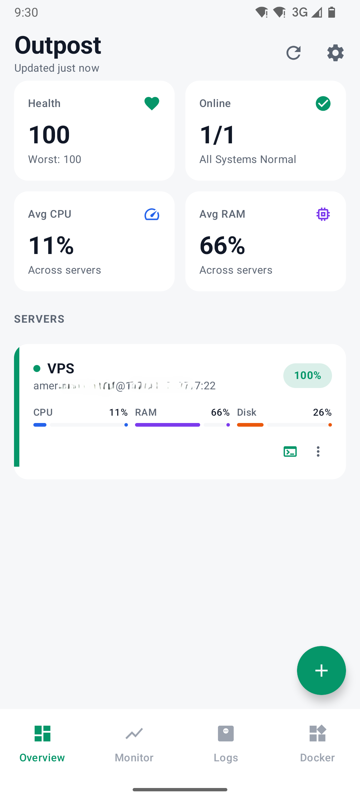
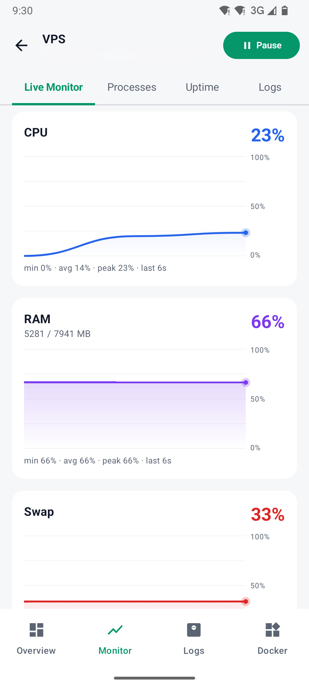
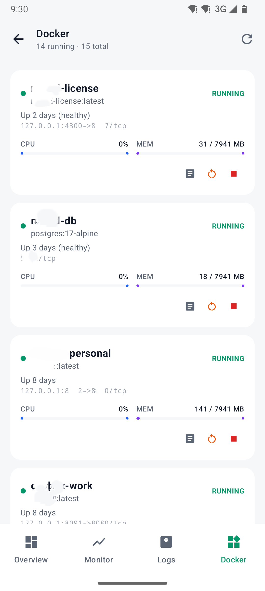

<div align="center">

# Outpost

**An SSH terminal and live VPS monitor for Android.**

Connect to your servers, watch them breathe, and fix them from your phone.

[](LICENSE)
[](#requirements)
[](https://kotlinlang.org)
[](https://developer.android.com/jetpack/compose)
[](https://github.com/ameralkhorasani/Android_VPS_Terminal/actions/workflows/ci.yml)

</div>

---

## Table of contents

- [What is Outpost?](#what-is-outpost)
- [Screenshots](#screenshots)
- [Features](#features)
- [Requirements](#requirements)
- [Install](#install)
- [Build and run](#build-and-run)
- [Your first connection](#your-first-connection)
- [Testing](#testing)
- [Architecture](#architecture)
- [Project structure](#project-structure)
- [Contributing](#contributing)
- [Security](#security)
- [Roadmap](#roadmap)
- [License](#license)
- [Acknowledgements](#acknowledgements)

---

## What is Outpost?

Outpost is an open-source Android app for people who run their own servers. It is
three tools in one:

1. **A real SSH terminal.** A full PTY backed by [xterm.js][xterm], so `htop`, `vim`,
   `tmux` and colour output all behave the way they do on a desktop.
2. **A live system monitor.** CPU, RAM, swap, disk, load average, network throughput
   and uptime, sampled straight from `/proc` over the same SSH connection — no agent,
   no daemon, and nothing to install on the server.
3. **A set of power-user tools.** SSH port forwarding that survives you leaving the
   app, Docker container control, journal and file log tailing, a one-tap remote
   VS Code (`code-server`) workflow, and per-server alert thresholds.

Outpost talks to your servers using nothing but **stock OpenSSH**. There is no
backend, no telemetry, no account, and no cloud service in the middle. Your keys
never leave your phone.

> **Agentless by design.** Every metric is read with ordinary shell commands
> (`cat /proc/stat`, `df`, `docker ps`). If you can SSH into it, Outpost can
> monitor it.

---

## Screenshots

> Screenshots are placeholders. Drop real captures into [`docs/screenshots/`](docs/screenshots/)
> using these exact filenames and they will render here automatically.

| Overview | Live monitor | Terminal |
|:--:|:--:|:--:|
|  |  |  |
| Every server at a glance, with a health score | CPU, RAM, disk, network, load | Full PTY with colour and control keys |

| Port forwarding | Docker | Logs |
|:--:|:--:|:--:|
|  |  |  |
| Tunnels that keep running in the background | Start, stop, restart, stream logs | Follow journals and files live |

---

## Features

### Terminal
- Full interactive PTY over SSH, rendered with xterm.js.
- Correct handling of colour, cursor addressing, and window resize (`SIGWINCH`).
- An extra key row for `Esc`, `Tab`, `Ctrl`, `Alt` and arrows — the keys a soft
  keyboard does not give you.
- The bottom navigation bar steps aside when the keyboard is up, so the terminal
  keeps every row it can.

### Monitoring
- **CPU** — computed from successive `/proc/stat` deltas, including `iowait` and
  `steal`, so a noisy-neighbour VPS reports honestly.
- **Memory** — used, total and swap from `/proc/meminfo`.
- **Disk** — usage for the root filesystem.
- **Network** — receive and transmit throughput in KB/s, derived from interface
  counter deltas.
- **Load average** and **uptime**.
- A **0–100 health score** per server, scored against *that server's own*
  thresholds rather than fixed constants — a box you expect to sit at 80% disk
  should not be reported as sick.

### Power tools
- **SSH local port forwarding** (`ssh -L` from a phone). Forwards run inside a
  foreground service, so a tunnel stays up while you browse `http://localhost:<port>`
  in another app. Saved forwards can auto-start on connect.
- **Docker control** — list containers with status and stats, start/stop/restart,
  and stream `docker logs -f`.
- **Log tailing** — follow `journalctl -f` or any file on disk with live output.
- **Remote editor** — detect, install and launch `code-server` on the VPS, then open
  it locally through an automatically created SSH tunnel. `code-server` is only ever
  bound to the server's loopback interface; it is never exposed to the internet.
- **Alerts** — per-server CPU, RAM, disk and TLS-expiry thresholds.
- **Themes** — light, dark, and system, with a terminal-appropriate palette.

### Under the hood
- Room database with **real, non-destructive migrations** — upgrading the app never
  drops your servers or your stored keys.
- A **safe mode** screen that catches an unrecoverable startup crash and shows the
  stack trace instead of dying silently.

---

## Requirements

### To run the app

| | |
|---|---|
| **Android** | 8.0 Oreo (API 26) or newer |
| **A server** | Any host you can already reach over SSH |
| **Auth** | An **OpenSSH private key**, optionally passphrase-protected |

For the monitoring screens the server should be Linux with a normal `/proc`
filesystem — that is, essentially any mainstream distribution. Docker features
additionally need the Docker CLI installed and your user able to run it.

> **Password authentication is not supported, deliberately.** Key-based auth is the
> only mode offered. See [Security](#security).

### To build the app

| | |
|---|---|
| **JDK** | 17 |
| **Android SDK** | Platform 35, Build Tools 35.x |
| **Android Studio** | Ladybug (2024.2.1) or newer — optional, Gradle alone is enough |
| **Gradle** | Provided by the wrapper; do not install it yourself |

---

## Install

### From a release

Grab the latest APK from the [Releases][releases] page and install it. You will need
to allow installation from unknown sources for whichever app is doing the installing.

Verify the download before you trust it:

```bash
sha256sum outpost-<version>.apk
# compare against the checksum published on the release page
```

### From source

See [Build and run](#build-and-run).

---

## Build and run

### 1. Clone

```bash
git clone https://github.com/ameralkhorasani/Android_VPS_Terminal.git
cd Android_VPS_Terminal
```

### 2. Point Gradle at your Android SDK

Create `local.properties` in the repository root:

```properties
# macOS / Linux
sdk.dir=/path/to/Android/Sdk

# Windows (note the escaped separators)
# sdk.dir=C\:\\path\\to\\Android\\Sdk
```

This file is **gitignored on purpose** — it contains a path specific to your machine
and must never be committed.

### 3. Build

```bash
# Debug APK -> app/build/outputs/apk/debug/app-debug.apk
./gradlew assembleDebug

# Install straight onto a connected device or emulator
./gradlew installDebug

# Unsigned release build
./gradlew assembleRelease
```

On Windows use `gradlew.bat` in place of `./gradlew`.

### 4. Run the checks

```bash
./gradlew check                       # unit tests + lint
./gradlew testDebugUnitTest
./gradlew lintDebug
./gradlew connectedDebugAndroidTest   # needs a device or emulator
```

### Building a signed release

Never commit a keystore or its passwords. Keep them outside the repository and pass
them in as Gradle properties or environment variables:

```bash
./gradlew assembleRelease \
  -Pandroid.injected.signing.store.file=/path/to/your.keystore \
  -Pandroid.injected.signing.store.password="$KEYSTORE_PASSWORD" \
  -Pandroid.injected.signing.key.alias="$KEY_ALIAS" \
  -Pandroid.injected.signing.key.password="$KEY_PASSWORD"
```

---

## Your first connection

Outpost authenticates with SSH keys only. If you do not already have a dedicated key
for your phone, make one — do not reuse the key on your laptop.

**1. Generate a key pair on your computer**

```bash
ssh-keygen -t ed25519 -f ~/.ssh/outpost_phone -C "outpost-android"
```

Use a passphrase. Outpost can store it encrypted and unlock the key for you.

**2. Authorise the public key on the server**

```bash
ssh-copy-id -i ~/.ssh/outpost_phone.pub your-username@your.vps.example.com
```

**3. Add the server in the app**

Tap **+** on the Overview screen and fill in:

| Field | Example |
|---|---|
| Name | `Web server` |
| Host | `your.vps.example.com` or `203.0.113.10` |
| Port | `22` |
| Username | `your-username` |
| Private key | paste the **contents of `~/.ssh/outpost_phone`** (the file *without* `.pub`) |
| Passphrase | the passphrase you chose, if any |

The key is encrypted with a hardware-backed Android Keystore key before it touches
storage. See [Security](#security).

**4. Harden the server (recommended)**

```
# /etc/ssh/sshd_config
PasswordAuthentication no
PermitRootLogin no
```

```bash
sudo systemctl reload ssh
```

> Every host, user and address in this README is a placeholder. `example.com` and
> `203.0.113.0/24` are reserved by RFC 2606 and RFC 5737 for documentation and route
> nowhere.

---

## Testing

| Layer | Location | What belongs there |
|---|---|---|
| **Unit** | `app/src/test/` | Pure logic: `StatsParser`, `HealthScore`, `SshKeyUtils`, formatting |
| **Instrumented** | `app/src/androidTest/` | Room migrations, `SecureKeyManager` against a real Keystore, navigation smoke tests |

The parsing and scoring logic is deliberately free of Android dependencies so it can
be tested on the JVM with sample `/proc` fixtures — no device, no server, no network.

```bash
./gradlew testDebugUnitTest
```

**Testing against a real server** needs a host you control. A throwaway VM or a local
`sshd` in a container works well:

```bash
docker run -d --name outpost-test -p 2222:22 \
  -e USER_NAME=your-username \
  -e PUBLIC_KEY="$(cat ~/.ssh/outpost_phone.pub)" \
  linuxserver/openssh-server
```

Then add a server pointing at your machine's LAN address on port `2222`.

---

## Architecture

Outpost is a single-module Android app following **MVVM with a repository layer**,
built entirely on Kotlin coroutines and Flow.

```
┌──────────────────────────────────────────────────────────────┐
│  UI            Jetpack Compose + Material 3                  │
│                Screens are stateless; they render a UiState  │
│                and emit events upward.                       │
└───────────────────────────┬──────────────────────────────────┘
                            │  StateFlow<UiState>
┌───────────────────────────┴──────────────────────────────────┐
│  ViewModel     One per screen, Hilt-injected. Owns UiState,  │
│                runs work in viewModelScope, never touches    │
│                Android views or the SSH client directly.     │
└───────────────────────────┬──────────────────────────────────┘
                            │  suspend fun / Flow
┌───────────────────────────┴──────────────────────────────────┐
│  Repository    SshRepository, DockerRepository,              │
│                CodeServerRepository, TunnelManager,          │
│                SettingsRepository. All I/O lives here and    │
│                everything returns Result<T>.                 │
└──────────┬──────────────────────────────┬────────────────────┘
           │                              │
┌──────────┴───────────┐      ┌───────────┴─────────────────────┐
│  Local               │      │  Remote                         │
│  Room (servers,      │      │  SSHJ over TCP/22               │
│  port_forwards)      │      │  exec channels + PTY sessions   │
│  EncryptedSharedPrefs│      │  local port forwarding          │
│  Android Keystore    │      │                                 │
└──────────────────────┘      └─────────────────────────────────┘
```

### Key decisions

**Agentless metrics.** `SshRepository.sampleStats()` runs a single batched shell
command and `StatsParser` turns the output into a `ServerStats`. CPU and network are
rate quantities, so the parser keeps the previous sample and reports deltas; the
first sample after connecting therefore reads zero by design.

**Keys never leave the device unencrypted.** `SecureKeyManager` generates an
AES-256-GCM key in the Android Keystore (hardware-backed where available) and uses it
to encrypt private keys and passphrases before Room ever sees them. The Keystore key
itself is non-exportable.

**Tunnels outlive the UI.** A port forward is useless if it dies when you switch apps,
so `TunnelService` is a foreground service with a persistent notification, and
`TunnelManager` owns the lifecycle and reuses one SSH connection per server.

**Migrations are written, not generated away.** `AppDatabase` is at version 4 with
explicit `Migration` objects rather than `fallbackToDestructiveMigration()`. Losing a
user's encrypted SSH keys on an app update would be unforgivable.

**`Result<T>` everywhere.** A dropped connection is an expected outcome, not an
exception. `SuspendCatching` wraps I/O so failures surface as user-readable messages
instead of crashes.

### Technology

| Concern | Choice |
|---|---|
| Language | Kotlin 2.0 |
| UI | Jetpack Compose, Material 3, Navigation Compose |
| DI | Hilt (Dagger) |
| Persistence | Room |
| Crypto storage | AndroidX Security (`EncryptedSharedPreferences`) + Android Keystore |
| SSH | [SSHJ][sshj] + BouncyCastle |
| Terminal rendering | [xterm.js][xterm] in a `WebView`, bridged to the PTY stream |
| Async | Coroutines + Flow |
| Build | Gradle Kotlin DSL with a version catalog |

Deeper notes live in [`docs/ARCHITECTURE.md`](docs/ARCHITECTURE.md).

---

## Project structure

```
.
├── app/
│   └── src/
│       ├── main/
│       │   ├── assets/
│       │   │   ├── scripts/        # Shell scripts uploaded to the server
│       │   │   └── terminal/       # Vendored xterm.js + the JS-to-Kotlin bridge
│       │   ├── java/io/github/ameralkhorasani/outpost/
│       │   │   ├── OutpostApp.kt   # @HiltAndroidApp entry point
│       │   │   ├── core/           # Cross-cutting: crash reporting, Result helpers
│       │   │   ├── data/
│       │   │   │   ├── db/         # Room database, DAOs, migrations
│       │   │   │   ├── model/      # Entities and value types
│       │   │   │   ├── preferences/# Settings persistence
│       │   │   │   └── security/   # Keystore, key parsing and validation
│       │   │   ├── domain/         # Pure logic: health scoring, thresholds
│       │   │   ├── ssh/            # SSH client, metrics, docker, editor, tunnels
│       │   │   ├── di/             # Hilt modules
│       │   │   └── ui/
│       │   │       ├── navigation/ # Routes and the nav graph
│       │   │       ├── theme/      # Colour, typography, Material 3 theme
│       │   │       ├── components/ # Reusable composables
│       │   │       └── screens/    # One package per screen: Screen + ViewModel
│       │   └── res/                # Strings, icons, themes, network config
│       ├── test/                   # JVM unit tests
│       └── androidTest/            # Instrumented tests
├── docs/                           # Architecture, guides, screenshots
├── gradle/
│   └── libs.versions.toml          # Single source of truth for dependencies
└── .github/                        # CI workflows, issue and PR templates
```

Each screen package holds exactly two files — `XScreen.kt` (composables) and
`XViewModel.kt` (state and logic). Finding the code behind a screen never requires a
search.

**Why one module?** At the current size a multi-module split would cost contributors
more in build configuration than it returns in build speed. The package boundaries
above are already the seams a future `:core` / `:feature:*` split would follow, and
nothing in `domain/` or `data/` depends on `ui/`.

---

## Contributing

Contributions are very welcome — bug reports, fixes, features, docs, translations.

1. **Open an issue first** for anything larger than a small fix, so effort is not
   duplicated.
2. **Fork and branch** from `main`: `git checkout -b feature/short-description`.
3. **Match the surrounding code.** Kotlin official style, four-space indent, and
   comments that explain *why* rather than *what*.
4. **Add tests** for logic changes. Anything parsing server output must have a
   fixture-based unit test.
5. **Run the checks** before pushing: `./gradlew check`.
6. **Open a pull request** describing what changed and how you verified it.

Full guidelines are in [CONTRIBUTING.md](CONTRIBUTING.md); the community standard is
in [CODE_OF_CONDUCT.md](CODE_OF_CONDUCT.md).

### Good first issues

Look for the [`good first issue`][gfi] label. Approachable areas include extra
terminal key-row keys, additional `/proc` metrics, more log presets, and widening
test coverage of `StatsParser`.

### One hard rule for contributors

**Never commit anything that identifies a real server.** No hostnames, IP addresses,
usernames, keys, or screenshots with live output. Use `your.vps.example.com`,
`your-username`, `path/to/private_key`, and the RFC 5737 documentation ranges. Redact
screenshots before attaching them.

---

## Security

Outpost handles SSH private keys, so it is worth being explicit about what it does
with them.

### What the app does

- **Private keys are encrypted at rest** with AES-256-GCM. The encryption key is
  generated inside the **Android Keystore** and is non-exportable — it cannot be read
  out of the device even with root, and on most modern hardware it lives in a secure
  element.
- **Key-based authentication only.** Password auth is not implemented, which removes
  a whole class of credential-stuffing and shoulder-surfing risk.
- **Nothing leaves the device except SSH traffic** to servers you configure. No
  analytics, no crash reporting service, no accounts, no update pings.
- **`allowBackup="false"`**, so encrypted key material is never swept into a cloud
  backup.
- **Cleartext HTTP is restricted to loopback** via a network security config — needed
  so the app can reach tunnelled services at `http://localhost:<port>`, and nowhere
  else.
- **Forwarded services stay private.** `code-server` is bound to the server's loopback
  interface and reached only through the SSH tunnel; it is never published to a public
  interface.

### What the repository contains

**No credentials, of any kind, anywhere.** No IP addresses, hostnames, usernames,
passwords, private keys, or server-identifying data. Every example uses a documented
placeholder. `local.properties`, `*.apk`, keystores and build output are gitignored.

If you fork this project, keep it that way.

### Reporting a vulnerability

Please **do not** open a public issue for a security problem. Use GitHub's
[private vulnerability reporting][advisories] instead. See [SECURITY.md](SECURITY.md)
for scope and response expectations.

### Honest limitations

- Outpost is maintained by volunteers and has **not had a third-party security
  audit**. Read the code before trusting it with production infrastructure.
- A rooted or compromised device undermines every guarantee above.
- Host key verification is trust-on-first-use. Confirm fingerprints out of band on a
  network you do not trust.

---

## Roadmap

- [ ] SFTP file browser with upload and download
- [ ] Jump host / bastion (`ProxyJump`) support
- [ ] Background alert notifications while the app is closed
- [ ] Home-screen widget for the health score
- [ ] Saved command snippets
- [ ] Hardware key support via FIDO2 / `ssh-sk`
- [ ] F-Droid distribution

Ideas are welcome — open an issue.

---

## License

Released under the [MIT License](LICENSE).

Third-party components keep their own licences, notably [SSHJ][sshj] (Apache 2.0),
[BouncyCastle][bc] (MIT), and [xterm.js][xterm] (MIT).

---

## Acknowledgements

Built on the work of [SSHJ][sshj], [xterm.js][xterm], [BouncyCastle][bc], and the
AndroidX and Jetpack Compose teams.

<div align="center">
<sub>Outpost is not affiliated with any hosting provider. Your servers are yours.</sub>
</div>

[xterm]: https://xtermjs.org
[sshj]: https://github.com/hierynomus/sshj
[bc]: https://www.bouncycastle.org
[releases]: https://github.com/ameralkhorasani/Android_VPS_Terminal/releases
[gfi]: https://github.com/ameralkhorasani/Android_VPS_Terminal/labels/good%20first%20issue
[advisories]: https://github.com/ameralkhorasani/Android_VPS_Terminal/security/advisories/new
